# Astrion Custom — a standalone Home Assistant UI for the Sanytron Astrion HA100

A from-scratch Android app that **replaces** the stock `HaRemote` app on the
Astrion remote with a fully custom, extensible UI you control end to end.

It connects directly to Home Assistant over the standard WebSocket API, renders
whatever cards and layouts you define, and maps the remote's physical buttons to
any action you want.

---

## Why this instead of customising HaRemote?

The stock app pulls your HA Lovelace dashboard, then keeps **only** cards whose
`type` is one of 11 hardcoded `custom:aiks-*` strings, redrawing them in a fixed
native style you can't change via CSS or HA. There is no plugin path — the card
registry is a static list compiled into the APK.

This app inverts that: **you** own the card taxonomy. Adding a brand-new native
card type is three small steps (below), and each card is plain Jetpack Compose,
so layout / colour / sizing / animation are entirely yours.

Nothing here depends on Sanytron's cloud or their custom HA integration — only a
reachable HA instance and a long-lived token.

---

## Build & install

Requirements: Android Studio (Ladybug or newer) with the Android SDK.

1. Open the project folder in Android Studio and let it sync Gradle.
2. Copy `secrets.properties.example` to `secrets.properties` (gitignored —
   never committed) and fill in your own values:
   ```properties
   haUrl=http://<your-ha-ip>:8123
   haToken=<long-lived access token>
   ```
   Create the token in HA: Profile → Security → Long-lived access tokens.
   These are injected as `BuildConfig.HA_URL` / `BuildConfig.HA_TOKEN` at build
   time, so a real token never lands in source control.
3. Build the APK: **Build → Build App Bundle(s) / APK(s) → Build APK(s)**,
   or from a terminal with the SDK on PATH: `./gradlew assembleDebug`.
4. Install onto the remote over ADB (same way you pulled the stock APK):
   ```
   adb install app/build/outputs/apk/debug/app-debug.apk
   ```
5. Launch it. To make it the default home experience you can set it as launcher
   or just open it manually; the stock HaRemote app can stay installed
   alongside.

### Screenshots

| Main | TV / Plex | Sonos |
|---|---|---|
| 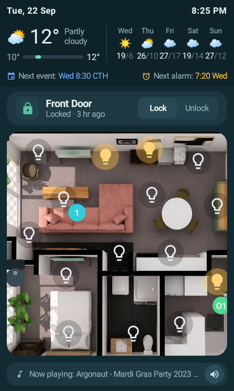 | 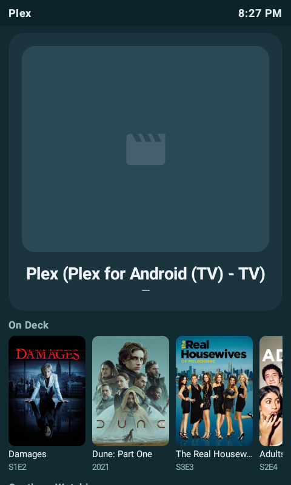 | 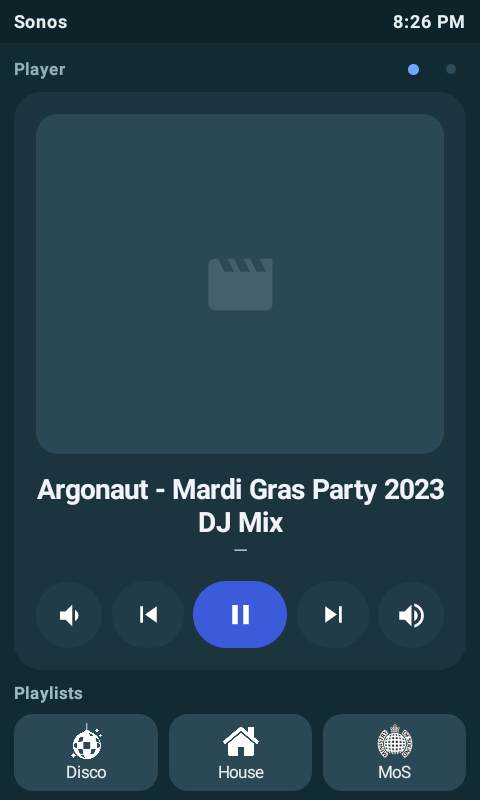 |
| **Plex rows** | **Music shelves** (swipe) | **Climate** |
| 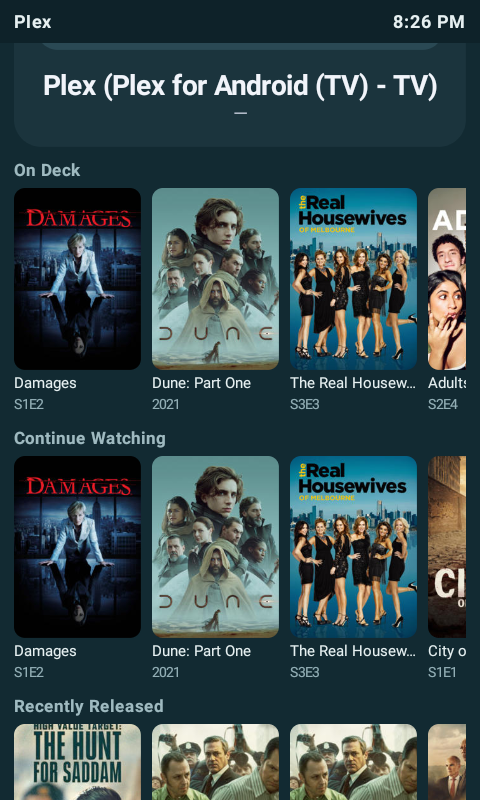 | 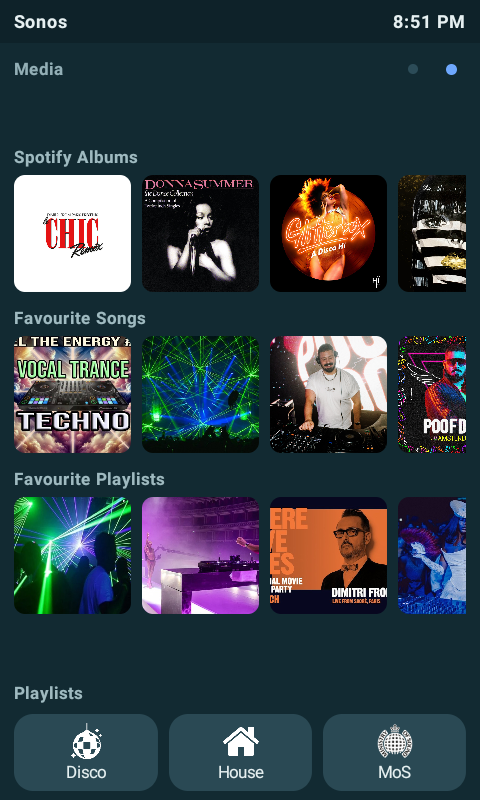 | 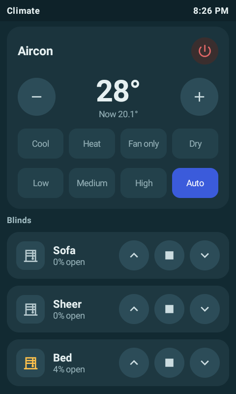 |
| **Alarm** | **Alarm — snoozed** | **IR Mode** |
| 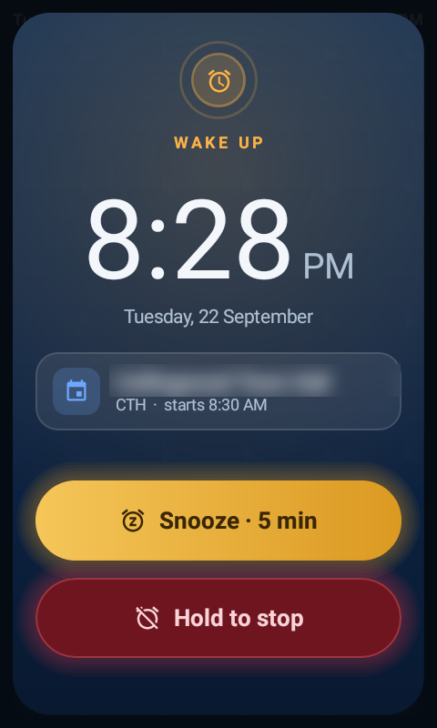 | 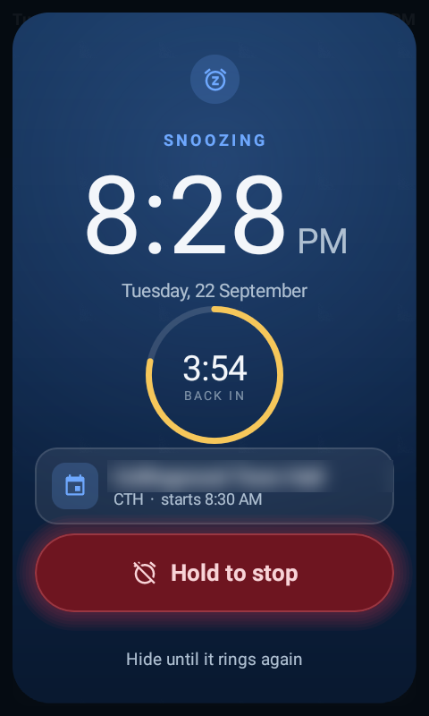 | 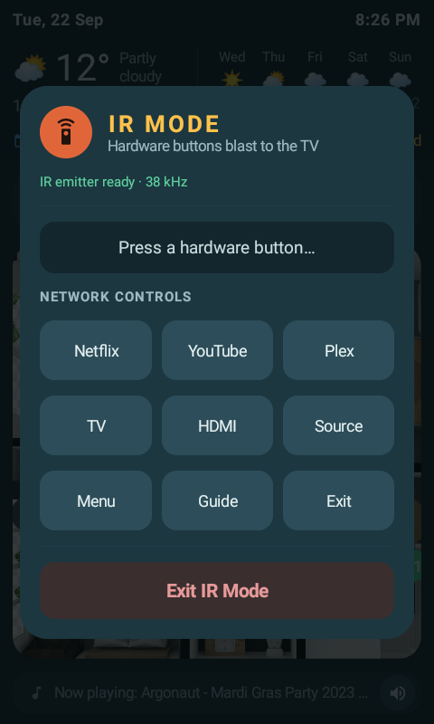 |
| **Speaker group** | | |
| 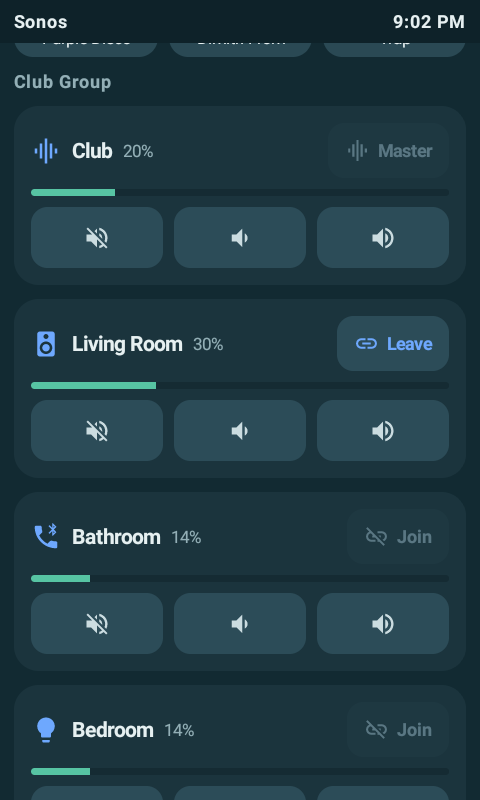 | | |

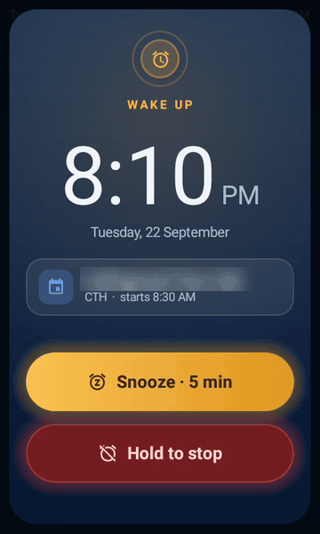

More: `screenshots/LD2450-tracking.gif` (mmWave presence dots moving live on the
floorplan), `sonos-control.gif` (speaker group + volume), the robot-vacuum
overlay and popup (`robovac-*.png`), and the light colour popup (`light-*.png`).

### What it does

- **Main** — a glance panel (date, time, weather now + 5 days, next diary entry
  and next alarm), a door-lock card, a live floorplan with tappable lights,
  mmWave presence dots and the robot vacuum, and a one-tap mute strip.
- **TV / Plex** — what's on the TV, plus Plex poster rows where one tap plays
  the exact episode or film, even from a switched-off TV.
- **Media** — the full Sonos player with album-art shelves swiped in behind it,
  playlist shortcuts and speaker grouping.
- **Climate** — aircon with HVAC and fan modes, and the blinds.
- **Alarm popup** — wakes the screen for a Home Assistant alarm; snooze with a
  tap, stop with a hold.
- **Docked screensaver** — sit the remote in its dock and leave it: after 45 s
  it goes black with a big faded clock, dims the backlight (warm and very dim
  at night), and shows what's playing, running timers, tonight's alarm, the
  next diary entry and anything that needs attention (door unlocked). Any touch
  or button wakes it; lifting it off the dock takes it down.
- **IR Mode** — tap ☰ and the hardware buttons drive a Samsung TV over IR.
- **Every physical button** is configurable, with tap, 1.5 s hold and (opt-in)
  double-tap actions.

> Target: the HA100 runs Android 8.1 (API 27); `minSdk` is 26. Keep custom cards
> lightweight — the SoC (MT6580, 1 GB RAM) is modest.

---

## Add a new native card type (the whole point)

1. Create a renderer in `app/src/main/java/com/custom/astrion/cards/impl/`:
   ```kotlin
   class ThermostatCard : CardRenderer {
       override val type = "thermostat"
       @Composable
       override fun Render(config: CardConfig, ctx: CardContext) {
           // any Compose UI you like; read live state from ctx.entities,
           // fire actions with ctx.client.callService(...)
       }
   }
   ```
2. Register it in `AstrionApp.onCreate()`:
   ```kotlin
   CardRegistry.register(ThermostatCard())
   ```
3. Use it in `config/DashboardConfig.kt`:
   ```kotlin
   CardConfig("thermostat", mapOf("entity_id" to "climate.lounge"))
   ```

Order in `DashboardConfig.cards` is order on screen. An unregistered type shows
an inline warning rather than vanishing silently.

---

## Physical buttons

The HA100 button keycodes (extracted from the stock app's
`device_key_code.json`) are wired up in `input/HardwareKeys.kt`. Bind them in
`MainActivity.bindHardwareButtons()` — e.g. the dedicated LIGHT / SCENE / AC /
CURTAIN and CUSTOM_1..4 keys can each fire any service call. Presses arrive as
standard Android `KeyEvent`s, intercepted in `dispatchKeyEvent`.

---

## Project map

| Path | Role |
|------|------|
| `ha/HaClient.kt` | Standard HA WebSocket client (auth, get_states, subscribe, call_service, ping) |
| `ha/HaModels.kt` | Entity state + connection models |
| `cards/Card.kt` | `CardRenderer` interface + `CardRegistry` (extensibility core) |
| `cards/impl/*` | 29 card types — see the table in `COMMUNITY.md` for what each one does |
| `config/DashboardConfig.kt` | Your dashboard layout (compiled-in fallback; live layout is a JSON file, see below) |
| `config/DashboardLoader.kt` | Reads/writes `/sdcard/astrion/dashboard.json`, falls back to the compiled default |
| `ui/Dashboard.kt` | Renders the card list, page pager, pinned top/bottom sections |
| `ui/AlarmOverlay.kt` | The alarm popup |
| `ui/Screensaver.kt` | The docked screensaver (MainActivity owns the dock/idle detection and backlight) |
| `ui/Theme.kt`, `ui/CardKit.kt` | Shared palette, type scale and card building blocks |
| `ir/IrBlaster.kt`, `ir/IrModeOverlay.kt` | Samsung IR encoder over the built-in emitter, and the IR Mode popup |
| `input/HardwareKeys.kt` | HA100 keycode map + router (tap, long-press, double-tap) |
| `MainActivity.kt` | Compose host, hardware key dispatch, motion-wake, alarm wake |
| `AstrionApp.kt` | Registers card types at startup |
| `device/` | On-device scripts: restrict wireless ADB to your admin machine |
| `docs/` | Alarm popup spec, IR capture notes, UI critique |

See `COMMUNITY.md` for the full card reference, the JSON config schema, and
the physical-button map. See `ARCHITECTURE.md` for how the stock app works
internally and why this design follows from it.

---

## Status / caveats

- This is a working dashboard, actively running on two HA100 remotes day to
  day (a from-scratch replacement, not a scaffold anymore).
- Credentials come from `secrets.properties` (gitignored) via `BuildConfig` —
  see Build & install above.
- IR: the remote's own emitter is driven directly through Android's
  `ConsumerIrManager` (IR Mode, Samsung32 codes), so no Sanytron integration or
  cloud is involved. Control of everything else goes over the network through
  HA `remote.*` / `media_player.*` / `androidtv.*` services.
- **Don't publish an APK you built yourself**: the HA URL and token are compiled
  into it.
- See `CHANGELOG.md` for what changed in each release.
