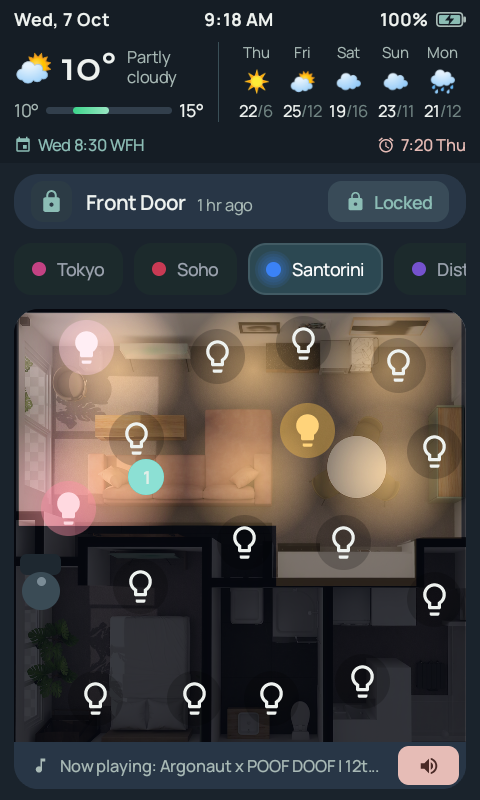
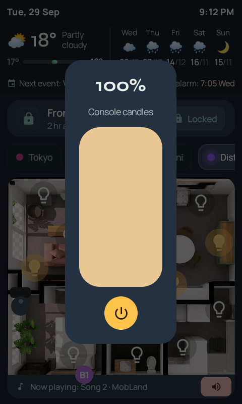
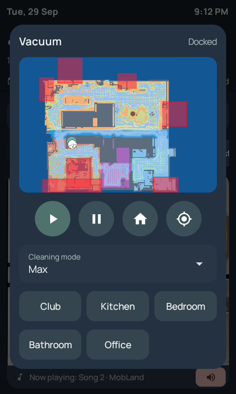
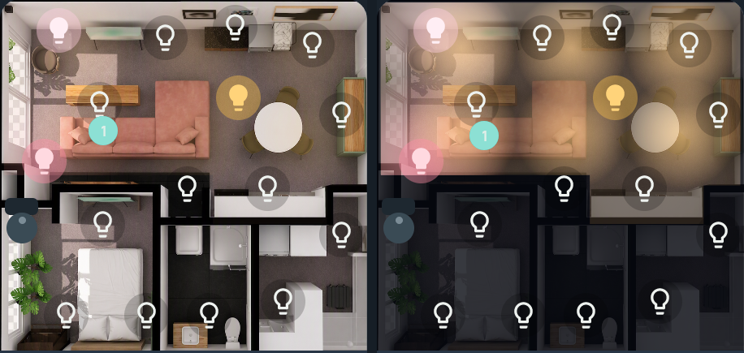

# Astrion Custom

A native Home Assistant dashboard for the **Sanytron Astrion HA100** remote,
written from scratch to replace the stock `HaRemote` app.

It talks to Home Assistant over the standard WebSocket API, draws whatever
pages and cards you describe in one JSON file, and lets every physical button
do whatever you want. It doesn't use Sanytron's cloud or their HA integration.

| Main | Main at night | TV | Climate |
|---|---|---|---|
|  |  |  |  |

It runs every day on two HA100s. Releases are listed in
[`CHANGELOG.md`](CHANGELOG.md).

---

## Why not just customise HaRemote?

The stock app reads your Lovelace dashboard and keeps only cards whose `type`
is one of 11 hardcoded `custom:aiks-*` strings. It redraws those in a fixed
style that HA and CSS can't change, and the card list is compiled into the APK,
so you can't add to it. A real HA dashboard in a WebView (Fully Kiosk, the
Companion app) is far too slow on the HA100's 2015-era MT6580 with 1 GB of RAM.

This app owns the whole rendering layer instead. Each card is plain Jetpack
Compose, and adding a new card type takes three small steps
([below](#add-a-card-type)).

---

## What it does

- **Main page.** The date, time, weather now and for five days, your next
  calendar entry and next alarm. Below that: a one-tap door lock, scene pills
  (the last one used glows) and a live floor plan with tappable lights, mmWave
  presence dots and the robot vacuum. A now-playing and mute strip runs along
  the bottom.
- **Lit rooms.** The floor plan glows in each light's real colour and
  brightness. As the sun sets, rooms with nothing on fall gradually into shade,
  and a room with a light on keeps a soft glow. [More below](#lit-rooms).
- **TV and Plex.** What's on the TV (poster, show, episode, progress), one-tap
  app logos, and Plex poster rows where one tap plays that exact episode or
  film, even if the TV is off.
- **Media.** A full Sonos player with Player, Media and Zones tabs: album-art
  shelves, playlist shortcuts and speaker grouping.
- **Climate.** The aircon with HVAC and fan modes, a fan row (tap it for speed,
  modes, swing and sleep timer) and the blinds.
- **Alerts.** Leak, intruder, washer-done and door-left-unlocked popups,
  driven entirely by Home Assistant state.
- **Alarm.** Wakes the screen for a Home Assistant alarm. Tap to snooze, hold
  to stop.
- **Voice.** The remote works as a Home Assistant Assist satellite, using the
  mic button or an optional wake word.
- **Docked screensaver.** Leave the remote in its dock and after 45 s it
  shows a big dim clock, what's playing, timers, the next alarm and anything
  that needs attention. It's warmer and dimmer at night.
- **IR Mode.** Tap ☰ and the hardware buttons drive a Samsung TV over the
  remote's own IR emitter.
- **Every physical button is configurable,** with tap, 1.5 s hold and
  (opt-in) double-tap actions.
- **Battery-aware.** It lets the screen turn off (the stock app keeps it on
  forever), limits the wake word and motion wake once the remote is off its
  dock, and reports battery to HA. See [`docs/POWER.md`](docs/POWER.md).

### More screenshots

| TV and Plex | Sonos player | Music shelves |
|---|---|---|
|  |  |  |
| **Plex rows** | **Speaker zones** | **Alert popup** |
|  |  |  |
| **Docked screensaver** | **Alarm** | **Alarm, snoozed** |
|  |  |  |
| **IR Mode** | **Light popup** (long-press a light) | **Vacuum popup** |
|  |  |  |


Older captures, in the previous colours: `LD2450-tracking.gif` (mmWave
presence dots moving on the floor plan), `sonos-control.gif`,
`robovac-docked.png`, `robovac-kitchen.png` and `light-card.png`.

---

## Build and install

You need Android Studio (Ladybug or newer) with the Android SDK, or just the SDK
and JDK 17 for command-line builds.

1. **Add your Home Assistant details.** Copy `secrets.properties.example` to
   `secrets.properties` (gitignored) and fill it in:
   ```properties
   haUrl=http://<your-ha-ip>:8123
   haToken=<long-lived access token>
   ```
   Create the token in HA under Profile → Security → Long-lived access tokens.
   Both values are compiled in as `BuildConfig` fields, so the token never goes
   into source control.

2. **Build the release APK.** In Android Studio, choose the `release` build
   variant and Build → Build APK(s), or run:
   ```bash
   ./gradlew assembleRelease
   ```
   Use release on the remote, because debug builds are much slower on the
   MT6580. It's signed with your debug key, so you don't need a keystore.

3. **Install it over ADB and compile it ahead of time.** Android installs apps
   in its slowest (interpreted) mode, which made 89% of frames janky on the
   HA100:
   ```bash
   adb install -r app/build/outputs/apk/release/app-release.apk
   adb shell cmd package compile -m speed -f com.custom.astrion
   ```

4. **Once per remote, let the app manage the screen timeout.** The stock app
   keeps setting it to "never"; see [`docs/POWER.md`](docs/POWER.md).
   ```bash
   adb shell appops set com.custom.astrion WRITE_SETTINGS allow
   ```

5. **Launch it.** You can make it the home app (see
   [`docs/POWER.md`](docs/POWER.md#making-it-the-home-app)) or open it
   yourself. The stock HaRemote app can stay installed alongside it.

> **Don't publish an APK you built.** Your HA URL and token are compiled into it.

---

## Configuration

The layout, buttons and features all come from one JSON file on the remote, so
changing them doesn't need a rebuild:

| File | What it is |
|---|---|
| `/sdcard/astrion/dashboard.json` | The live config: pages, cards, buttons, alerts, alarm, screensaver, voice, power |
| `device/config/dashboard.json` | The default config, bundled into the APK. On first launch the app writes it to the path above. |
| `/sdcard/astrion/floorplan.png`, `icons/*.png` | Your floor-plan render and custom icons |

Edit the file and push it, then bring the app back to the front (it re-reads
the file on resume):

```bash
adb push dashboard.json /sdcard/astrion/dashboard.json
```

If the JSON doesn't parse, the app falls back to the bundled default and shows
a banner saying why. It never crashes over config.

The main top-level blocks:

| Key | Controls |
|---|---|
| `pages`, `startPage` | Pages and their cards, in screen order |
| `hotkeys`, `longHotkeys`, `doubleHotkeys` | What each button does on tap, hold and double-tap |
| `alerts` | Popups driven by entity state (leak, washer, door…) |
| `alarm` | The alarm popup's entities and snooze and stop actions |
| `screensaver` | Docked screensaver: idle time, brightness, what it shows |
| `voice` | Assist pipeline and wake word |
| `power` | Battery reporting to HA ([`docs/POWER.md`](docs/POWER.md)) |
| `ir_mode` | IR Mode's toggle key and Samsung codes |

[`COMMUNITY.md`](COMMUNITY.md) has the full card reference, the config schema
and the default button map.

### Lit rooms

Lit rooms are set up with a `lit_rooms` block on the `picture_elements` (floor
plan) card. Room outlines and light positions are percentages of the plan, the
same as icon positions.



```json
"lit_rooms": {
  "shade": "sun",
  "rooms": [
    { "name": "Bedroom",
      "shape": [[0, 51], [43, 51], [43, 100], [0, 100]],
      "lights": ["light.bedroom_lights", "light.bedlamps"] }
  ]
}
```

| Option | Default | Meaning |
|---|---|---|
| `shade` | `"sun"` | `"sun"` darkens gradually as the sun goes from 6° to −6°; `"night"` switches at sunset; `"always"` or `"off"` |
| `shade_alpha` | `0.8` | How dark a room with no lights on gets |
| `glow` | `0.6` | Strength of the light colour at night |
| `day_glow` | `0.3` | Share of that strength in full daylight |
| `room_glow` | `0.3` | How much a room with any light on is lifted out of the shade |
| `reach` | `26` | Size of each light's pool, % of the plan's width |

A floor-plan light can also take `glow_spots` (several fittings for one entity,
like a set of downlights) and `glow_reach` (to size its own pool). Nothing
animates at rest: the layer only redraws, with a short fade, when a light or
the sun changes.

---

## Physical buttons

The HA100's buttons arrive as ordinary Android key events. The keycode map
(taken from the stock firmware) is in
[`input/HardwareKeys.kt`](app/src/main/java/com/custom/astrion/input/HardwareKeys.kt),
and tap, hold and double-tap timing is handled in
[`input/KeyDispatcher.kt`](app/src/main/java/com/custom/astrion/input/KeyDispatcher.kt).
What each key does comes from the config:

```json
"hotkeys":       [ { "key": "AC", "page": "Climate" },
                   { "key": "UP", "service": "remote.send_command",
                     "entityId": "remote.tv", "data": { "command": "DPAD_UP" } } ],
"longHotkeys":   [ { "key": "PAGE_UP", "service": "script.open_blinds" } ],
"doubleHotkeys": [ { "key": "SCENE", "service": "media_player.media_next_track",
                     "entityId": "media_player.club" } ]
```

The key names are `UP DOWN LEFT RIGHT CENTER`, `PAGE_UP PAGE_DOWN`,
`VOLUME_UP VOLUME_DOWN MUTE`, `BACK HOME POWER VOICE MENU`,
`LIGHT CURTAIN SCENE AC` and `CUSTOM_1` to `CUSTOM_4` (the coloured row). A key
with a double-tap action waits about 0.3 s after a tap to see if a second one
is coming. Every other key fires immediately.

---

## Add a card type

1. Write a renderer in
   [`cards/impl/`](app/src/main/java/com/custom/astrion/cards/impl):
   ```kotlin
   class ThermostatCard : CardRenderer {
       override val type = "thermostat"
       @Composable
       override fun Render(config: CardConfig, ctx: CardContext) {
           // Any Compose UI. Read live state from ctx.entities and
           // call services with ctx.client.callService(...).
       }
   }
   ```
2. Register it in `AstrionApp.onCreate()`:
   ```kotlin
   CardRegistry.register(..., ThermostatCard())
   ```
3. Use it in `dashboard.json`:
   ```json
   { "type": "thermostat", "options": { "entity_id": "climate.lounge" } }
   ```

Cards appear in the order they're listed. An unregistered type shows an inline
warning instead of silently disappearing.

> The HA100 runs Android 8.1 (API 27) on an MT6580 with 1 GB of RAM. Keep cards
> light: no blur, no per-frame recomposition, and decode images downsampled.

---

## Project map

All source paths are under `app/src/main/java/com/custom/astrion/`.

| Path | Role |
|---|---|
| `AstrionApp.kt` | Registers card types; owns the single HA connection |
| `MainActivity.kt` | Compose host, key dispatch, alarm and alert wake, screensaver and backlight |
| `ha/` | HA WebSocket client (auth, `subscribe_entities`, `call_service`), entity models, shared HTTP client |
| `cards/Card.kt` | `CardRenderer` and `CardRegistry`, the extension point |
| `cards/impl/` | The 29 card types, plus the lit-rooms layer (`LitRooms.kt`) and the light and fan popups |
| `config/` | Loads `dashboard.json` (`DashboardLoader`), config models, typed feature options |
| `ui/` | Pager (`Dashboard.kt`), alarm, alert and voice overlays, screensaver, theme and shared card parts |
| `input/` | Keycode map and tap, hold and double-tap dispatch |
| `power/` | Dock and battery rules, motion wake |
| `voice/` | Assist satellite session and its overlay |
| `ir/` | Samsung IR encoder over the built-in emitter, and IR Mode |

Elsewhere in the repo:

| Path | Role |
|---|---|
| `device/config/dashboard.json` | Bundled default config |
| `device/` | On-device scripts that restrict wireless ADB to your admin machine ([`device/README.md`](device/README.md)) |
| `docs/` | Battery and home-app setup ([`POWER.md`](docs/POWER.md)), companion HA automations ([`HOME_ASSISTANT.md`](docs/HOME_ASSISTANT.md)), alarm spec, IR capture notes, UI critique |
| `ARCHITECTURE.md` | How the stock app works and why this design follows from it |
| `scripts/` | Screenshot and screen-recording helpers, the unused-import check |

---

## Development

On every push, CI ([`.github/workflows/ci.yml`](.github/workflows/ci.yml)) runs
an unused-import check, the unit tests, Android lint and a release build. To
run the same checks locally:

```bash
python3 scripts/check_unused_imports.py
./gradlew testDebugUnitTest lintDebug assembleRelease
```

Unit tests cover key timing, battery and dock rules, alert and alarm state,
next-alarm parsing, config parsing and that the bundled `dashboard.json` loads.

---

## Notes

- **IR** goes through Android's `ConsumerIrManager` on the remote's own
  emitter. Everything else goes over the network through HA services
  (`remote.*`, `media_player.*`, `androidtv.*`).
- **Wireless ADB on the HA100 is wide open by default.** It's a `userdebug`
  build, so anyone on the LAN gets a root shell.
  [`device/README.md`](device/README.md) explains how to lock it down.
- **Licence:** MIT ([`LICENSE`](LICENSE)). Manrope and Syne are used under the
  SIL Open Font License ([`licenses/`](licenses)).
